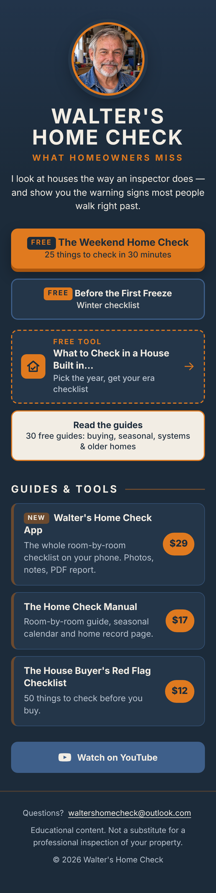

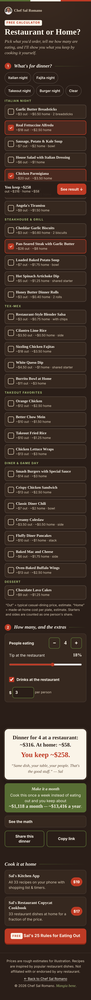

# Link pages for Walter and Sal

Two small "link in bio" pages, hosted free on GitHub Pages:

| Page | Address |
|---|---|
| Walter's Home Check | https://plazzers.github.io/links/walter/ |
| Chef Sal Romano | https://plazzers.github.io/links/sal/ |
| Free tool: What to Check in a House Built in… | https://plazzers.github.io/links/walter/house-age/ |
| Free tool: Restaurant or Home? | https://plazzers.github.io/links/sal/restaurant-or-home/ |
| Small index (two buttons) | https://plazzers.github.io/links/ |

Each page is a single file you can edit in any text editor, or right on github.com
(open the file → pencil icon → edit → **Commit changes**). The live site updates
about a minute after you commit.

 

## What's where

```
index.html              the small index page
walter/index.html       Walter's page (all text, links and styling)
walter/og.jpg           picture shown when the link is shared (1200x630)
walter/assets/          Walter's photo, favicon, phone home-screen icon
walter/house-age/       free tool "What to Check in a House Built in…" (page + og.jpg)
sal/...                 the same for Sal
sal/restaurant-or-home/ free tool "Restaurant or Home?" calculator (page + og.jpg)
pins/                   Pinterest pins, bulk CSVs, contact sheets and a review gallery
source-assets/          original photos (not used by the pages directly) + cut-outs for the pins
tools/make_og.py        rebuilds the share pictures and the page photos
tools/make_pins.py      builds all Pinterest pins (content in tools/pins_walter.yaml, pins_sal.yaml)
tools/check_pins.py     checks the pins and CSVs
tests/check.js          automatic checks + screenshots (docs/screens/)
tests/tools.js          the checks for the two free tools (run by check.js)
```

## Change a link

Find the old link in `walter/index.html` or `sal/index.html` and replace it. Keep the
tracking bit at the end of every Payhip link so Payhip can show that buyers came from
this page:

```html
href="https://payhip.com/b/NEWCODE?utm_source=links&amp;utm_medium=bio"
```

(In HTML the `&` is written as `&amp;` — keep it that way.)

## Change a price

Each product is a "card". The price is in the line with `class="price"`:

```html
<span class="price">$17</span>
```

Change the number, commit, done.

## Add a product card

Copy a whole card — everything from `<li>` to `</li>` — and paste it right below.
Then change the link, the title, the one-line description and the price:

```html
<li>
  <a class="card" href="https://payhip.com/b/NEWCODE?utm_source=links&amp;utm_medium=bio">
    <span class="card-title">Product name</span>
    <span class="card-desc">One short sentence about what it is.</span>
    <span class="price">$15</span>
  </a>
</li>
```

To show a **NEW** label, put `<span class="badge">NEW</span>` at the start of the title:

```html
<span class="card-title"><span class="badge">NEW</span>Product name</span>
```

To remove a card, delete its `<li> … </li>` block. To remove a NEW label, delete the
`<span class="badge">NEW</span>` part.

If you add or change Payhip links, also update the list of expected links near the top
of `tests/check.js`, otherwise the check will (correctly) report a difference.

## Change the photo or the share picture

1. Replace `source-assets/walter.jpg` or `source-assets/sal.jpg` (square, face in the middle).
2. Run `python3 tools/make_og.py` (needs Python with Pillow: `pip install pillow`).
   This rebuilds the page photo (kept under 80 KB) and `og.jpg` for both pages.
3. Commit the changed files.

Facebook, X and others cache share pictures. After a change, paste the page address
into the Facebook Sharing Debugger and click "Scrape again" to refresh it.

## The free tools

Both tools are single pages with a little plain JavaScript inside — no build step, no
cookies, nothing loaded from other sites. Everything a visitor picks is kept in the page
address, so a link can be shared and opens with the same answers:

- `walter/house-age/?year=1972&own=1` — year (or a decade: `pre1950`, `1950s` … `2010s`),
  `own=1` for "already own it", optional `found=basement,crawl,slab`.
- `sal/restaurant-or-home/?d=2,5,9&p=4` — dish numbers and people; optional `t=20`
  (tip %) and `dr=0` (drinks per person, 0 = off).

They're linked from the main pages by the dashed **FREE TOOL** card under the free PDF
buttons. Their Payhip links use a different tracking bit so Payhip shows which tool sent
the buyer:

```html
href="https://payhip.com/b/CODE?utm_source=links&amp;utm_medium=tool&amp;utm_campaign=house-age"
```

(`utm_campaign=restaurant-or-home` on Sal's tool.)

**Edit Walter's checklist:** open `walter/house-age/index.html` and find `var ERA = [`.
Each item has `from` / `to` (the build years it applies to), a `tag` (`PRO` = "Have a pro
check", `DIY` = "Look yourself"), a `title`, `why`, `look`, and optional `buy` / `own`
tips. `FOUND` holds the basement/crawlspace/slab items and `ALWAYS` the ones every house
gets. Keep the wording cautious ("roughly", "common in") and leave out prices.

**Edit Sal's prices:** open `sal/restaurant-or-home/index.html` and find `var DISHES = [`.
Each line is `[number, title, restaurant price, home cost, group]` — change the two
numbers. Keep the dish numbers as they are, or shared links will point at the wrong
dishes. Sal's six one-liners are in `var LINES`. If you change the prices of dishes used
in `tests/tools.js` (the `SAL` list near the top), update them there too.

**Share pictures:** `python3 tools/make_og.py` also rebuilds each tool's `og.jpg`.

 

## Pinterest pins

120 ready-made pins (60 for Walter, 60 for Sal), 1000×1500, hosted on this site so
Pinterest can fetch them. Every pin links back to a page here with
`?utm_source=pinterest&utm_medium=pin&utm_campaign=<pin name>`: Walter's "older homes"
pins go to the house-age tool, Sal's money pins to the Restaurant or Home? calculator,
the rest to the main pages.

| What | Where |
|---|---|
| Review gallery (all pins with title, board, date, link) | https://plazzers.github.io/links/pins/ |
| Contact sheets | `pins/contact-walter.jpg`, `pins/contact-sal.jpg` |
| Bulk upload files | `pins/pinterest-bulk-walter.csv`, `pins/pinterest-bulk-sal.csv` |

The gallery is not linked from anywhere and tells search engines not to index it.

**Upload a CSV to Pinterest** (one per Pinterest account):

1. You need a Pinterest **business** account (free; you can convert a personal one in
   Settings).
2. Create the boards first, with exactly these names (the CSV puts each pin on one):
   - Walter: *Home Maintenance Checklists*, *Buying a House Tips*, *Older Home Problems*,
     *Winter Home Prep*, *Seasonal Home Maintenance*
   - Sal: *Copycat Restaurant Recipes*, *Easy Italian Dinners*, *Restaurant Secrets*,
     *Budget Family Dinners*
3. Click **Create** → **Create Pins in bulk** → **Upload .csv file**, and pick the file.
4. Pinterest fetches the images and schedules each pin for its *Publish date*: 3 a day at
   13:00, 17:00 and 21:00 UTC, from 10 October 2026, alternating topics. To post everything
   at once instead, clear that column (open the CSV in a spreadsheet, keep it UTF-8 CSV).
   Pinterest only accepts dates in the future, so if you upload after 10 October, rebuild
   with a later start date (`START` near the top of `tools/make_pins.py`).

**Add or change pins:** all text lives in `tools/pins_walter.yaml` and
`tools/pins_sal.yaml` — open one, copy a block of the same kind, change it and add it
at the end of the list (the comment at the top of each file explains every field; wrap
the words to highlight in `*stars*`, `|` forces a line break). Then:

```sh
pip install pillow pyyaml      # once
python3 tools/make_pins.py     # rebuilds pins, CSVs, contact sheets and gallery (~40 s)
python3 tools/check_pins.py    # checks sizes, CSV format, links, dates and wording rules
```

Look at the contact sheets, then commit everything in `pins/`. The generator shrinks a
headline that's too long; if one still doesn't fit it stops and names the pin, so shorten
that text. Sal's money numbers come straight from the calculator's price list, so they
always match it. Fonts (Oswald, Source Sans 3, Inter, Playfair Display, all under the
Open Font License) are in `tools/fonts/`. The cut-out photos
`source-assets/*-cutout.png` were made once with a background-removal model
(`rembg`, model `birefnet-portrait`); if you replace a host photo, make a new cut-out the
same way.

Content rules the check enforces: no real restaurant names, no prices on Walter's pins,
no health claims, at most 10 Walter pins that mention a product. Recipe times and
ingredient counts on Sal's pins are estimates — fix them in `pins_sal.yaml` if the
cookbook says otherwise.

## Turn on GitHub Pages (one time)

1. On github.com open the repo **plazzers/links** → **Settings** → **Pages**.
2. Under **Build and deployment**, set **Source** to **Deploy from a branch**.
3. Choose branch **main** and folder **/ (root)**, then **Save**.
4. Wait 1–2 minutes and open https://plazzers.github.io/links/walter/.

The empty `.nojekyll` file tells GitHub to serve the files as they are.

## Run the checks (optional)

The checks open every page in a headless Chrome at phone size (390×844) and desktop size
(1280×800) and confirm: every link matches the spec exactly, every Payhip link carries the
tracking params, no sideways scrolling, images load, no console errors, buttons are at
least 48px tall, meta/share tags are present, and each page stays under 150 KB (photo
excluded). For the two tools it also clicks through them: picks years and decades,
checks which items appear for which era, does the restaurant math, reloads shared links
to make sure the answers come back, tries Copy, Share and Print, and checks the Payhip
links carry `utm_medium=tool` and the right `utm_campaign`. Screenshots are saved to
`docs/screens/` (including `*-print-*.png` for the print view).

```sh
npm install playwright        # once
npx playwright install chromium   # once, if you don't already have a Chromium for Playwright
node tests/check.js           # or NODE_PATH="$(npm root -g)" node tests/check.js if installed globally
```

## Notes

- No cookies, no trackers, no outside fonts — the pages load instantly. The main pages
  have no scripts at all; the two tools use a small built-in script and nothing else.
- Each page has one fixed brand look, so it looks the same in light and dark mode.
- Sal's pages never name real restaurant brands; keep it that way when adding products or dishes.
- Walter's tool is educational only — the page footer says so; keep that line.
